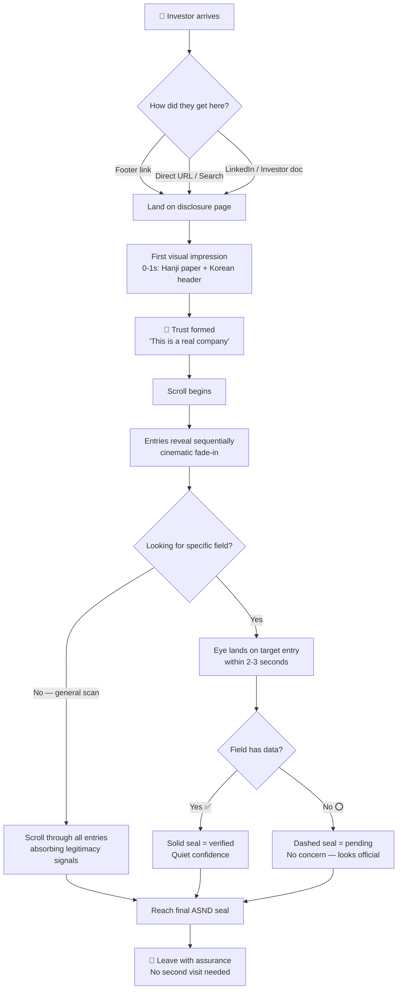
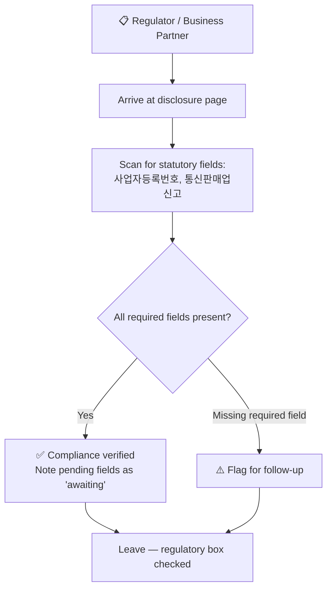

x---
stepsCompleted: [1, 2, 3, 4, 5, 6, 7, 8, 9, 10, 11, 12, 13, 14]
inputDocuments:
  - "src/app/contact/page.tsx"
  - "src/app/globals.css"
  - "src/app/layout.tsx"
  - "src/app/page.tsx"
---

# UX Design Specification — ASND Label Website

**Author:** there
**Date:** 2026-06-19

---

## Executive Summary

### Project Vision

The Public Disclosure page is ASND Label's investor-facing transparency statement — a page that communicates legitimacy, heritage, and stability to financial stakeholders. It satisfies Korean regulatory requirements while making investors feel they're looking at an established entertainment company with roots and pride. The aesthetic is **vintage Korean** — evoking nostalgia, craftsmanship, and permanence.

### Target Users

**Primary: Investors & Financial Stakeholders**
- Checking business registration, legitimacy, and contact info
- Often on mobile — quick scrolling verification
- Need scannable, authoritative, complete-looking information
- The design must whisper: "This company has history and substance"

**Secondary: Regulators & Business Partners**
- Verifying compliance data
- Desktop users who expect standard disclosure formatting

### Key Design Challenges

1. **Trust through aesthetics** — A plain table signals bare-minimum compliance. A crafted, vintage-Korean design signals permanence — exactly what investors want.
2. **Incomplete data handling** — Some fields come from Excel later. Placeholder states must look intentional (like pending official stamps), not broken.
3. **Regulatory coldness vs. warmth** — Disclosure pages are inherently bureaucratic. The vintage aesthetic must humanize without compromising clarity or compliance.
4. **Responsive scannability** — Investors must skim on mobile and find specific fields fast. Both devices matter.

### Design Opportunities

1. **Vintage Korean business certificate aesthetic** — Hanji paper textures, traditional dojang (도장) stamp motifs, calligraphic hierarchy
2. **Scroll-driven narrative** — Transform a flat table into a curated scroll experience that reveals information with dignity
3. **Stamp/seal as validation** — Use the "chop/seal" visual language that Koreans instinctively associate with official documents
4. **Heritage color palette** — Faded indigo, worn vermillion, aged ivory — the palette of old Korean shop registers and certificates

## Core User Experience

### Defining Experience

The core user action for the Public Disclosure page is a single-loop scan: **Investor lands → scans for legitimacy signals → finds the specific field they need → leaves with trust.** No multi-step flows, no forms — just a trust-building scan experience where the aesthetic does as much work as the data.

### Platform Strategy

| Factor | Decision |
|---|---|
| Platform | Web (responsive) |
| Primary device | Mobile (scrolling scan) |
| Secondary | Desktop (business review) |
| Touch vs. mouse | Both — tap-friendly spacing on mobile, hover states on desktop |
| Offline | Not needed — static content |
| Device-specific | Scroll-driven reveal animations on both |

### Effortless Interactions

1. **Zero hunt** — Field labels must be instantly distinguishable. No scanning through dense text to find "Business Registration Number."
2. **Visual trust signal on landing** — Before reading a single field, the vintage Korean aesthetic communicates "established company." The user trusts before they verify.
3. **Intentional emptiness** — Missing Excel fields should look like a deliberate "awaiting official seal" state, not a bug. The user shouldn't even question it.
4. **Scroll dignity** — Each disclosure item revealed with weight, not just a row in a table. Like turning pages of an official ledger.

### Critical Success Moments

| Moment | Success looks like |
|---|---|
| **First 0.5s on page** | User thinks: "This is a real company with history" — not "template website" |
| **Finding a specific field** | Eye lands on the right block in under 2 seconds |
| **Encountering a blank field** | User thinks: "Official info pending" — not "this site is broken" |
| **Leaving the page** | User has verified what they needed and leaves with quiet confidence |

### Experience Principles

1. **Trust before verification** — The aesthetic earns credibility before the data confirms it
2. **Every field has weight** — Disclosure isn't a chore; it's a statement of pride
3. **Absence is intentional** — Blank fields are official, not broken
4. **Scroll as ceremony** — The page unfolds like an official document, not a spreadsheet
5. **Bilingual dignity** — Korean and English both feel native, not translated

## Desired Emotional Response

### Primary Emotional Goals

| When the user... | They should feel... |
|---|---|
| Lands on the page | **Grounded** — like they've arrived at something with substance, not a fly-by-night operation |
| Scans the header | **Reverence** — the vintage Korean aesthetic signals heritage and permanence |
| Reads disclosure fields | **Quiet confidence** — "This information carries weight, not just legal boilerplate" |
| Leaves the page | **Assured** — no lingering doubt; the company is legitimate, established, and proud |

**Primary emotion: Assured trust** — not excitement, not delight, but deep, quiet confidence.
**Secondary: Nostalgic pride** — the vintage Korean design evokes roots, history, and cultural legitimacy.

### Emotional Journey Mapping

```
Landing → Curiosity → "What is this?" (the vintage aesthetic is unexpected for a disclosure page)
    ↓
First visual impression → Grounded reverence → "This feels like an established institution"
    ↓
Scanning fields → Quiet confidence → Each field reads like an official entry, not a database row
    ↓
Finding target field → Subtle satisfaction → "There it is — exactly what I needed"
    ↓
Leaving → Assurance → No second-guessing; the company checks out
```

### Micro-Emotions

| Critical pair | We want | We avoid |
|---|---|---|
| Trust vs. Skepticism | **Trust** — earned through aesthetic and presentation | Skepticism triggered by a "too modern" or generic template look |
| Confidence vs. Confusion | **Confidence** — every field is findable and readable | Confusion from dense wall-of-text layout |
| Belonging vs. Isolation | **Belonging** — the Korean vintage language says "you understand this culture" | Isolation from a cold, internationalized corporate feel |
| Satisfaction vs. Frustration | **Satisfaction** — information found effortlessly | Frustration from hunting through an unstructured list |
| Calm vs. Anxiety | **Calm** — the page breathes; not information overload | Anxiety from feeling like something is missing or broken |

### Design Implications

| Emotional goal | UX design approach |
|---|---|
| **Grounded reverence** | Aged paper textures, hanji-inspired backgrounds, traditional seal (도장) motifs as visual anchors |
| **Quiet confidence** | Generous whitespace around each field; typographic hierarchy treating each entry like a ledger line |
| **Nostalgic pride** | Faded indigo + worn vermillion palette; Korean calligraphic styling for headers |
| **Assurance** | Intentional completeness — even blank fields look like "awaiting official stamp" |
| **Calm** | Slow, dignified scroll animations; no flashy transitions — the page breathes |

### Emotional Design Principles

1. **Quiet over loud** — Confidence doesn't shout; it's in the details
2. **Heritage over novelty** — Vintage Korean motifs ground the page in cultural legitimacy
3. **Weight over speed** — Every element carries gravity; animations are slow and deliberate
4. **Craft over template** — Hand-crafted feel (hanji textures, stamp motifs) over generic design systems
5. **Presence over performance** — The page exists to be felt, not just read

## UX Pattern Analysis & Inspiration

### Inspiring Products & References

**1. Traditional Korean Ledger (전통 장부)**
The primary visual DNA. Old Korean business ledgers feature:
- Vertical or structured grid entry layouts
- Stamped red seals (도장) marking each entry as official
- Faded hanji paper tones — warm ivory, not sterile white
- Hand-brushed or carved woodblock headers
- Deliberate, heavy borders separating entries — each line carries weight

**2. K-pop Industry Identity**
This isn't generic vintage — it must be identifiable as K-pop industry:
- The polish of album packaging (physical CD/LP liner notes aesthetic)
- Entertainment company gravitas — official company, not fan site
- ASND's existing brand merged with vintage textures: deep navy base with soft pink/blue accents

**3. Cinematic Gravitas**
The feeling of earned wisdom, weight, and meaning:
- Opening credits of a prestige Korean film — slow, deliberate typography
- The gravity of an important document being unsealed
- A museum-quality artifact presented behind glass
- Not flashy, not fast — ceremonial

### Transferable UX Patterns

| Pattern | Source | Application |
|---|---|---|
| **Ledger-grid layout** | 전통 장부 | Each disclosure field becomes a "ledger entry" — stacked vertically with strong horizontal rules |
| **Seal-as-validation** | Traditional 도장 stamps | Blank/missing data fields show a "pending seal" watermark instead of empty space |
| **Liner notes polish** | K-pop album packaging | Typography echoing physical album credits — refined, intentional hierarchy |
| **Ceremonial reveal** | Prestige film credit sequences | Scroll-triggered fade-in of each entry like pages turning — slow, dignified |
| **Warm heritage palette** | Hanji paper + aged ink | Faded indigo text on warm ivory backgrounds — not black-on-white corporate |
| **Dual-language dignity** | Korean entertainment industry | Korean first (culturally native) with English secondary — coexisting, not translated |

### Anti-Patterns to Avoid

| Anti-pattern | Why to avoid |
|---|---|
| **Minimalist Swiss-style tables** | Feels cold, generic, template-like — opposite of "proud and nostalgic" |
| **Over-animated K-pop fan aesthetic** | Too much sparkle or fast motion signals "fan content" not "investor document" |
| **Western corporate disclosure style** | SEC/EDGAR-style dense text blocks — culturally wrong and emotionally flat |
| **Fake-old distressed effects** | Overly grungy textures feel like a theme park, not genuine heritage |
| **QR-code-first or app-store aesthetic** | Too contemporary tech — this page should feel timeless, not trendy |

### Design Inspiration Strategy

**What to Adopt:**
- 전통 장부 grid structure — each field is a weighted entry with a horizontal rule
- Red seal (도장) motif — used as a "verified" marker and as placeholder for pending data
- Warm ivory + faded indigo palette — grounded in hanji paper aesthetics

**What to Adapt:**
- K-pop album liner notes polish — apply to typographic hierarchy
- ASND brand colors — navy becomes "indigo ink," pink becomes "vermillion seal"
- Cinematic scroll reveals — slow but not slow enough to annoy a scanning investor

**What to Avoid:**
- Any minimalist/brutalist pattern that strips emotion from the page
- Any trend-driven web design (glassmorphism, bento grids, neon gradients)
- Any pattern that makes disclosure feel like an afterthought rather than a statement

## Design System Foundation

### Design System Choice

The project already uses **Tailwind CSS v4 with custom theme tokens** — a custom design system. For the Public Disclosure page, we extend this system with heritage-specific tokens and utilities rather than introducing a component library.

### Rationale for Selection

1. **Already custom** — The project chose Tailwind with custom tokens from the start. Adding another component library would create visual conflict with the vintage direction.
2. **Heritage demands craft** — Pre-built component libraries are inherently "clean/modern" — the opposite of our aesthetic.
3. **Single page scope** — A few targeted CSS utilities is lighter than pulling in a full system.
4. **Typography control** — Adding a Korean serif font for headers is trivial with Tailwind's font stack.

### New Design Tokens

| Token | Purpose | Value |
|---|---|---|
| `--paper` | Hanji-inspired ivory background | `#F5F0E8` |
| `--paper-dark` | Aged paper edges / depth | `#EBE3D5` |
| `--ink` | Faded indigo text | `#2A3450` |
| `--ink-light` | Secondary/muted text | `#5A6988` |
| `--seal` | Vermillion stamp red | `#C44536` |
| `--seal-faded` | Watermark/placeholder seal | `rgba(196, 69, 54, 0.15)` |
| `--rule` | Ledger line border | `#D4C9B5` |

### New Utility Classes

| Utility | Purpose |
|---|---|
| `.ledger-entry` | Wraps each disclosure field with vertical rhythm and horizontal rule |
| `.seal-mark` | The 도장 stamp visual for verified / pending states |
| `.hanji-surface` | Background with subtle paper texture |
| `.cinematic-reveal` | Scroll-triggered slow fade-up for each entry |
| `.korean-header` | Header style evoking calligraphic/woodblock titles |

### Implementation Approach

1. Add new CSS custom properties to `globals.css` for heritage tokens
2. Add new `@layer utilities` for ledger, seal, and reveal patterns
3. Import a Korean serif font (e.g., Noto Serif KR) via `next/font` for headers
4. Compose the disclosure page with Tailwind classes + new heritage utilities

## Core User Experience — Defining Interaction

### Defining Experience

> **"Scroll through a Korean business ledger and verify company information — each entry revealed with the gravity of an official document being unsealed."**

It's not filling a form or navigating an app. It's a **ceremonial scroll** where the page lands like an old document placed on a desk, each field emerges with weight, and the investor scans, finds their field, trusts, and leaves.

### User Mental Model

| Aspect | Current expectation | What we deliver |
|---|---|---|
| What a disclosure page looks like | Boring legal table, black text on white | A Korean ledger — warm paper, inked entries, stamped seals |
| How to find information | Scan a dense list, hunt for labels | Each entry is a distinct block — impossible to miss |
| What "blank fields" mean | Broken/incomplete website | A document awaiting its official seal — perfectly normal |
| Emotional framing | "I'm checking a box legally" | "I'm verifying a company with roots" |

### Success Criteria

| When... | Success is... |
|---|---|
| Landing (0–1s) | The ivory paper texture and Korean header telegraph "established institution" |
| First scroll (1–3s) | The first ledger entry reveals with a slow cinematic fade — "oh, this is different" |
| Finding a field (3–5s) | The eye lands on the target field with zero hunting; each entry visually distinct |
| Seeing a blank field | The "awaiting seal" watermark is clearly intentional — no confusion |
| Leaving | Quiet confidence. No second visit needed. Trust established. |

### Novel vs. Established Patterns

**Established:** Vertical scroll, label-value pairs, responsive layout — users already know how to scroll and read.

**Novel twist:** The **presentation layer** — a Korean ledger aesthetic applied to regulatory data. No new interaction to learn; the novelty is purely visual and emotional. We don't teach users anything new — we make them feel something.

### Experience Mechanics

**1. Initiation:**
- User arrives from a footer link or direct URL
- No splash, no loading — the page is already there, like a physical document on a desk
- The header immediately signals "official Korean business document"

**2. Interaction:**
- User scrolls naturally
- Each disclosure entry fades up (`cinematic-reveal`) with a 150ms stagger between entries
- Horizontal ledger rules separate entries — visually heavy, physically grounding
- Each entry: label (left, muted ink), value (right, dark ink), seal indicator (right edge)

**3. Feedback:**
- Verified fields show a subtle red seal mark (도장) — "this is official"
- Pending fields show a faded/watermark seal — "awaiting stamp"
- No tabs, no clicks, no complexity — scroll is the only navigation
- Paper texture and warm palette provide constant ambient reassurance

**4. Completion:**
- The last entry is "Representative Email" — a natural endpoint
- Below it, a full-bleed company seal (large 도장) as a final "verified" gesture
- The footer follows naturally — no abrupt ending

## Visual Design Foundation

### Color System

**Heritage Palette (extends existing ASND brand):**

| Role | Token | Value | Usage |
|---|---|---|---|
| Page background | `--paper` | `#F5F0E8` | Full-page hanji ivory |
| Surface depth | `--paper-dark` | `#EBE3D5` | Card/section borders, subtle depth |
| Primary text | `--ink` | `#2A3450` | Field values, headers |
| Secondary text | `--ink-light` | `#5A6988` | Field labels, muted info |
| Seal / accent | `--seal` | `#C44536` | Verified 도장 stamp, key accents |
| Seal watermark | `--seal-faded` | `rgba(196,69,54,0.15)` | Background stamp for pending fields |
| Ledger rule | `--rule` | `#D4C9B5` | Horizontal dividers between entries |

**Continuity with ASND brand:**
- `--foreground` (#1E2A44) maps to `--ink` (#2A3450) — slightly softened for faded ink feel
- `--accent` (#F7C8D8) is NOT used here — too pink for an investor document. Replaced with `--seal` (vermillion)
- `--brand` (#1E2A44) appears only in site header/footer, not the disclosure itself

### Typography System

| Role | Font | Weight | Usage |
|---|---|---|---|
| Page title (KO) | **Noto Serif KR** | 700 | Main header — calligraphic, woodblock feel |
| Page title (EN) | Geist Sans | 900 | English header — matches site's brand weight |
| Field labels | Geist Sans | 400 | Muted, secondary — `--ink-light` |
| Field values | Geist Sans | 600 | Strong, readable — `--ink` |
| Seal text | Geist Mono | 500 | Small monospace for registration numbers |
| Sub-label | Geist Sans | 400, uppercase, tracked | Category markers (e.g., "DISCLOSURE") |

**Type Scale:**

| Level | Mobile | Desktop |
|---|---|---|
| Page title KO | 2rem (32px) | 3.5rem (56px) |
| Page title EN | 1.5rem (24px) | 2.75rem (44px) |
| Field label | 0.8125rem (13px) | 0.875rem (14px) |
| Field value | 1rem (16px) | 1.125rem (18px) |
| Seal stamp text | 0.625rem (10px) | 0.6875rem (11px) |

### Spacing & Layout Foundation

**Principles:**
1. **Generous vertical rhythm** — Each ledger entry sits in its own breathing room
2. **Single column** — No sidebars, no cards side-by-side. This is a document, not a dashboard.
3. **Centered but not narrow** — Max-width ~720px on desktop

**Spacing scale (8px base):**

| Token | Value | Usage |
|---|---|---|
| Entry padding-y | 24px (3×8) | Vertical padding within each ledger entry |
| Entry gap | 0 (rules handle separation) | Horizontal rule is the divider |
| Section margin | 64px (8×8) | Between header section and entries |
| Page padding-x | 24px mobile / 48px desktop | Breathing room on edges |

**Layout structure:**

```
┌──────────────────────────────┐
│     Header (page title,      │
│     subtitle, context)       │  ← generous top padding
│                              │
│──────────────────────────────│  ← top rule (thicker)
│  Label          Value    ◎   │  ← ledger entry + seal
│──────────────────────────────│
│  Label          Value    ◎   │
│──────────────────────────────│
│  Label          [pending] ◎  │  ← watermark seal
│──────────────────────────────│
│            ...               │
│──────────────────────────────│
│         [Large 도장]         │  ← final seal
└──────────────────────────────┘
```

### Accessibility Considerations

- **Contrast:** `--ink` (#2A3450) on `--paper` (#F5F0E8) = ~10.5:1 (exceeds WCAG AAA)
- **Contrast (secondary):** `--ink-light` (#5A6988) on `--paper` = ~4.8:1 (meets AA for large text; keep labels ≥13px)
- **Seal indicator:** Red 도장 is decorative only; field status also communicated via text ("Verified" / "Pending")
- **Reduced motion:** `cinematic-reveal` respects `prefers-reduced-motion` (already in `globals.css`)
- **Screen reader:** Disclosure uses proper `<dl>` semantics with `<dt>`/`<dd>` pairs

## Design Direction Decision

### Design Directions Explored

**Direction 1: Korean Ledger (선택됨 / Selected)**

The primary and only direction explored — a direct translation of the 전통 장부 (traditional Korean ledger) aesthetic into a web disclosure page. Features: hanji paper background, Noto Serif KR calligraphic headers, staggered cinematic ledger entry reveals, 도장 seal indicators for verified/pending states, and a final company seal stamp.

Live mockup reviewed and approved at `docs/ux-design-directions.html`.

### Chosen Direction

**Korean Business Ledger** — every design decision flows from the 전통 장부 metaphor:
- Page = a physical ledger document placed on a desk
- Entries = official lines in a business register
- Seals = 도장 stamps verifying authenticity
- Scroll = turning the pages of a bound book

### Design Rationale

1. **Uniquely Korean** — No Western investor has seen a disclosure page like this. It immediately signals cultural roots and permanence.
2. **Emotionally aligned** — Delivers the "proud and nostalgic" directive through materiality (paper, ink, seals) rather than decoration.
3. **Investor-appropriate** — Ceremonial weight without flash; the page feels like a museum document, not a K-pop fan page.
4. **Technically achievable** — Built on existing Tailwind + custom CSS. No new dependencies except Noto Serif KR font import.
5. **Future-proof** — Pending data fields look intentional, so the design works with incomplete Excel data.

### Implementation Approach

1. Add heritage CSS tokens to `globals.css` (--paper, --ink, --seal, --rule, etc.)
2. Add utility classes: `.ledger-entry`, `.seal-verified`, `.seal-pending`, `.hanji-surface`, `.cinematic-reveal`
3. Import Noto Serif KR via `next/font/google` in layout or page component
4. Rewrite `page.tsx` with ledger layout, seal indicators, and bilingual Korean-first labeling
5. Handle blank/pending fields with the dashed seal + placeholder text pattern

## User Journey Flows

### Journey 1: Investor Verification Scan (Primary)

The core user journey — an investor arrives to verify ASND Label's legitimacy. The entire interaction is a single scroll through the ledger.



### Journey 2: Regulatory Compliance Check (Secondary)

A regulator or business partner verifies statutory compliance fields.



### Journey Patterns

| Pattern | Description |
|---|---|
| **Ceremonial scroll** | All interaction is scroll-based. No clicks, no tabs, no forms. The page is consumed linearly like a physical document. |
| **Reveal-on-arrival** | Entries animate in on page load — the full ledger is visible after staggered animation completes (~1s). No lazy loading, no scroll-trigger. |
| **Seal-as-status** | The 도장 indicator is the only feedback element — a binary visual: verified (solid red) or pending (dashed). Meaning is culturally intuitive; no tooltips needed. |

### Flow Optimization Principles

1. **Zero decisions** — The user never chooses, clicks, or toggles. Only scroll and read. The most optimized flow: no flow at all.
2. **Single screenful on desktop** — All 6 entries visible without scrolling on typical 1440px; final seal requires a small scroll. On mobile, scrolling is natural.
3. **No loading state** — Server-rendered static content (Next.js). Instant paint. The cinematic reveal completes in under 1 second.
4. **One page, one purpose** — No cross-links mid-disclosure. Footer links back to the site naturally only after the final seal.

## Component Strategy

### Design System Components

No pre-built component library — the project uses custom Tailwind CSS. We reuse the existing site `Header` and `Footer` components plus Tailwind utility classes. All disclosure-specific components are custom-built.

### Custom Components

#### 1. `DisclosureLedger`

| Property | Spec |
|---|---|
| **Purpose** | Wraps the entire disclosure section with hanji background, paper texture, and paper shadow |
| **Anatomy** | `<section>` with `--paper` background, subtle grain overlay, centered max-width container |
| **States** | Default only (static page, always rendered) |
| **Accessibility** | `role="region"` with `aria-label="Public disclosure"` |
| **Tailwind** | `bg-[var(--paper)] max-w-3xl mx-auto px-6 md:px-12 py-20 md:py-24` |

#### 2. `LedgerEntry`

| Property | Spec |
|---|---|
| **Purpose** | One row in the ledger: label (left), value (right), seal indicator (far right) |
| **Anatomy** | Flex row with `border-b border-[var(--rule)]`, first entry has `border-t-2 border-[var(--rule-thick)]` |
| **States** | **Default**: entry hidden with `opacity-0 translate-y-6`, then `animate-cinematic-reveal` — **Pending**: dashed seal variant |
| **Variants** | `verified` / `pending` (controls which `SealIndicator` variant renders) |
| **Accessibility** | Uses `<dt>` for label, `<dd>` for value — proper `<dl>` semantics |
| **Props** | `labelKo: string`, `labelEn: string`, `value: string`, `status: 'verified' \| 'pending'` |

#### 3. `SealIndicator`

| Property | Spec |
|---|---|
| **Purpose** | Red 도장 circle indicating field verification status |
| **Anatomy** | Small circle (36px desktop, 28px mobile) with centered character |
| **States** | **Verified**: solid red border, `인` character, `aria-label="Verified"` — **Pending**: dashed red border at 25% opacity, `—` dash, `aria-label="Pending verification"` |
| **Accessibility** | Decorative only — status communicated via `aria-label` on parent entry. `aria-hidden="true"` on the visual itself. |

#### 4. `FinalSeal`

| Property | Spec |
|---|---|
| **Purpose** | Large company seal at the bottom of the ledger — the visual "signature" |
| **Anatomy** | Large circle (80px) with thick red border, `ASND` text, tagline below |
| **States** | Default — animates in with `animate-stamp-in` (scale + fade) |
| **Animation** | `@keyframes stampIn`: from `opacity-0 scale-90` to `opacity-100 scale-100`, 600ms ease-out, delayed after last entry |
| **Accessibility** | Purely decorative. `aria-hidden="true"`. |

### Component Implementation Strategy

**Foundation:** Tailwind CSS v4 custom tokens + existing site chrome (Header, Footer).

**Custom components** are built as inline React components within `page.tsx` or extracted to `src/components/disclosure/` — simple enough that a dedicated library is overkill.

**Design tokens** are the real "component library" here — the heritage CSS variables (`--paper`, `--ink`, `--seal`, `--rule`) ensure consistency across all elements without the overhead of a component framework.

### Implementation Roadmap

**Phase 1 — Core (immediate):**
1. Add heritage CSS tokens to `globals.css`
2. Add `cinematic-reveal` and `stamp-in` animations
3. Build `LedgerEntry` + `SealIndicator` components
4. Rewrite `page.tsx` with the full ledger layout

**Phase 2 — Polish:**
5. Import Noto Serif KR font via `next/font/google`
6. Add hanji paper grain texture utility
7. Responsive refinements (mobile entry stacking)
8. Final `FinalSeal` component

**Phase 3 — Excel data integration:**
9. Wire up pending field detection from data source
10. Ensure blank fields render with dashed seal + placeholder

## UX Consistency Patterns

### Bilingual Label Pattern

| Property | Pattern |
|---|---|
| **When to use** | Every disclosure field |
| **Visual** | Korean label on top (Noto Serif KR, 14px, `--ink-light`), English label below (Inter, 11px uppercase tracked, lighter) |
| **Rationale** | Korean-first signals cultural authenticity to Korean investors; English secondary ensures international accessibility |
| **Rule** | Korean always on top, English always below. Never side-by-side. |

### Status Indicator Pattern

| Property | Pattern |
|---|---|
| **When to use** | Every ledger entry that has a verification status |
| **Verified** | Solid red circle (2.5px `--seal`), centered `인` character. Means: "this data is confirmed." |
| **Pending** | Dashed red circle (2px, 25% opacity `--seal`), centered `—` dash. Means: "awaiting official data — not an error." |
| **Rule** | Never show a field without a seal indicator. Every entry has either verified or pending status. Blank data = pending, not absent. |

### Animation Timing Pattern

| Property | Pattern |
|---|---|
| **Entry reveal** | `cinematic-reveal`: 0.8s ease-out, staggered 100ms per entry, from `opacity-0 translate-y-6` |
| **Final seal** | `stamp-in`: 0.6s ease-out, delayed 200ms after last entry, from `opacity-0 scale-90` |
| **Reduced motion** | All animations disabled when `prefers-reduced-motion: reduce` — entries render at final position instantly |
| **Rule** | Never animate faster than 600ms. This page breathes. Speed kills the ceremonial feel. |

### Typography Hierarchy Pattern

| Level | Font | Weight | Color |
|---|---|---|---|
| Page title (KO) | Noto Serif KR | 700 | `--ink` |
| Page title (EN) | Inter (Geist Sans) | 400 | `--ink-light` |
| Field label (KO) | Noto Serif KR | 400 | `--ink-light` |
| Field label (EN) | Inter | 400, uppercase, tracked | `#8A95A8` |
| Field value | Inter / Noto Sans KR | 600 | `--ink` |
| Seal text | Geist Mono | 500 | `--seal` |

### Patterns Not Applicable

Deliberately skipped for this single-page disclosure: button hierarchy, form patterns, modal/overlay, search/filtering, loading states, empty states, error states. The page has no interactive UI elements beyond scroll.

## Responsive Design & Accessibility

### Responsive Strategy

| Device | Width | Layout |
|---|---|---|
| **Desktop** | 1024px+ | Max-width 720px container, centered. Horizontal flex entries. Paper shadow visible. Padding 48px sides, 80px vertical. |
| **Tablet** | 768–1023px | Same as desktop but padding reduced to 32px sides. Paper shadow visible. |
| **Mobile** | < 768px | Full-width (no paper shadow). Entries stack vertically: label top, value + seal below. Padding 24px sides, 56px vertical. Seals shrink to 28px. |

### Breakpoint Strategy

Tailwind defaults — mobile-first with `md:` (768px) and `lg:` (1024px):

| Breakpoint | Key change |
|---|---|
| Base (mobile) | Stacked entries, full-width, no paper shadow |
| `md:` (768px) | Horizontal flex entries, paper shadow appears |
| `lg:` (1024px) | Max-width container, full padding |

### Accessibility Strategy — WCAG AA Target

| Requirement | Implementation |
|---|---|
| **Color contrast** | `--ink` on `--paper` = 10.5:1 (AAA). `--ink-light` on `--paper` = 4.8:1 (AA, labels ≥13px) |
| **Semantic HTML** | `<dl>` / `<dt>` / `<dd>` for disclosure list. `<header>` / `<main>` / `<footer>` landmarks. |
| **Screen readers** | Seal indicators are `aria-hidden="true"` with status in parent `aria-label`. Skip-to-main link exists. |
| **Keyboard** | No interactive elements — page is fully static. No keyboard traps possible. |
| **Touch targets** | Seals are 36px desktop / 28px mobile. No tappable elements — purely visual. |
| **Reduced motion** | Already in `globals.css` — all animations disabled when `prefers-reduced-motion: reduce`. |
| **Focus indicators** | Already in `globals.css` — 2px brand outline on `:focus-visible`. |
| **High contrast** | Already supported — border and muted colors adjust via `prefers-contrast: high`. |

### Testing Strategy

- **Visual:** Test on iPhone + Android at 375px and 414px widths
- **Browser:** Chrome, Safari, Firefox — standard Next.js compatibility
- **Screen reader:** Pass with VoiceOver (macOS) and NVDA (Windows) on `<dl>` structure
- **Color blindness:** Deuteranopia/protanopia simulation — vermillion seal distinguishable from indigo ink

### Implementation Guidelines

1. Use Tailwind responsive prefixes (`md:`, `lg:`) — no custom media queries
2. Font sizes use `rem` — responsive via Tailwind's scale
3. Paper texture is CSS-only (repeating gradient) — no images to optimize
4. Noto Serif KR loaded via `next/font/google` with `subset: ['korean']` for minimal payload
5. All accessibility partially handled by existing `globals.css` (skip link, focus, reduced motion, high contrast)
